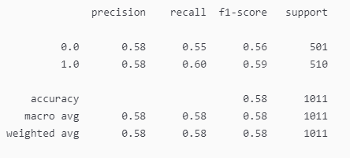

# Oil and Machine Learning

## Description
In this project, we aim to use machine models to help predict the price and price direction of oil. 

---
## Table of Contents
* [Description](#description)
* [Goals](#goals)
* [Technologies](#technologies)
* [Instructions](#instructions)
* [Conclusion](#conclusion)
* [Contributors](#contributors)
* [References and Resources](#references-and-resources)
* [License](#license)

---
## Goals 
Our goal is to compare two or more machine-learning models for identifying price and price direction of oil. For our predictions, we will use natural language processing to draw insights from news articles for the past 22 years. In addition, we will use oil close prices/returns, gold prices, S&P 500, as well as times of unrest (Iraq War 2003-2011). Machine learning typically requires extensive data preparation before the model can be trained. We will use Jupyter to prepare a training and testing dataset, and to train and compare the machine-learning model.

---
## Technologies
Our portfolio analysis will use the following technologies: 
* pandas
* numpy
* datetime
* pathlib
* nltk
* matplotlib
* analyzer
* dotenv
* New York Times API 
* yfinance API
* warnings
* tensorflow

  
  

---
## Instructions
1. To get the project started on your local machine, clone the GitHub repository. 
2. The first file we want to run is the [crude_news_data](crude_news_data.ipynb). This will get the [New York Times API](https://developer.nytimes.com/apis ) data for a set amount of years. *This may take around 45 minutes to run...*
3. The end result of this notebook will export a [combined_csv](headlines/combined_csv.csv) file in a headlines folder, with all other articles throughout each month. 
4. Next, we use the [crude_sentiment](crude_sentiment.ipynb) notebook that will get the news data from the [combined_csv](headlines/combined_csv.csv) and run a sentiment analysis which will export an [oil_sentiments](headlines/oil_sentiments.csv) csv file. 
5. Once we have the sentiment analysis data, we will load historical oil data and apply time series analysis and modeling to determine whether there is any predictable behavior in the [oil_series_analysis](oil_series_analysis.ipynb) notebook. 

---
## Conclusion
The oil price prediction worked better with the LSTM model compared to Linear Regression Model and Bayesian Ridge Model. While the Linear Regression uses one feature to predict the price, the Bayesian Ridge model used the five features considered and predicted the price using a normal distribution and probability. The price direction under the classification model worked slightly better in the random forest classifier compared to logistic regression. The feature importance of war in the price prediction was identified to be minimal compared to other features considered which could also be due to the fact that we had considered only one war period (due to lack of data availability). 

### Questions
<b>1. How has oil prices behaved in the past 22 years?  </b>
  
  

<b>2. What is the sentiment of oil across the period based on news articles using NLP?</b> 
  

<b>3. Identify other features for oil price movements (based on avialability of data)</b> 
  

<b>4. Compare model performances with each other when predicting oil prices.</b> 
-Linear Regression 
  
-LSTM 
  
-Bayesian Ridge 
  

<b>5. Compare model performances with each other when predicting oil returns direction. </b> 
-Logistic Regression 
  
-Random Forest 
  

<b>6. Compare feature importance in the movement of oil prices. </b> 
  

---
## Contributors
Our team: 
<h2><a href="https://github.com/GuilleMGN"> GuilleMGN</a></h2>

<h2><a href="https://github.com/ksmaria"> ksmaria</a></h2>

<h2><a href="https://github.com/Prabhdyals"> Prabhdyals</a></h2>

<h2><a href="https://github.com/Satheeshbm"> Satheeshbm</a></h2>

<h2><a href="https://github.com/Nitin-Thomas"> Nitin-Thomas</a></h2>

<h2><a href="https://github.com/dmerkulenko"> dmerkulenko</a></h2>

---
## References and Resources
[CNN Iraq War News](https://edition.cnn.com/2013/03/19/opinion/iraq-war-oil-juhasz/index.html )  
[Yahoo Finance](https://ca.finance.yahoo.com/ )  
[How to Collect Data From The New York Times Over Any Period of Time](https://towardsdatascience.com/collecting-data-from-the-new-york-times-over-any-period-of-time-3e365504004 )  
[New York Times API](https://developer.nytimes.com/apis )  
[Introduction to Bayesian Linear Regression](https://towardsdatascience.com/introduction-to-bayesian-linear-regression-e66e60791ea7 )  
[Bayesian Ridge Regression](https://www.datatechnotes.com/2019/11/bayesian-ridge-regression-example-in.html )  

## License

Copyright © 2022